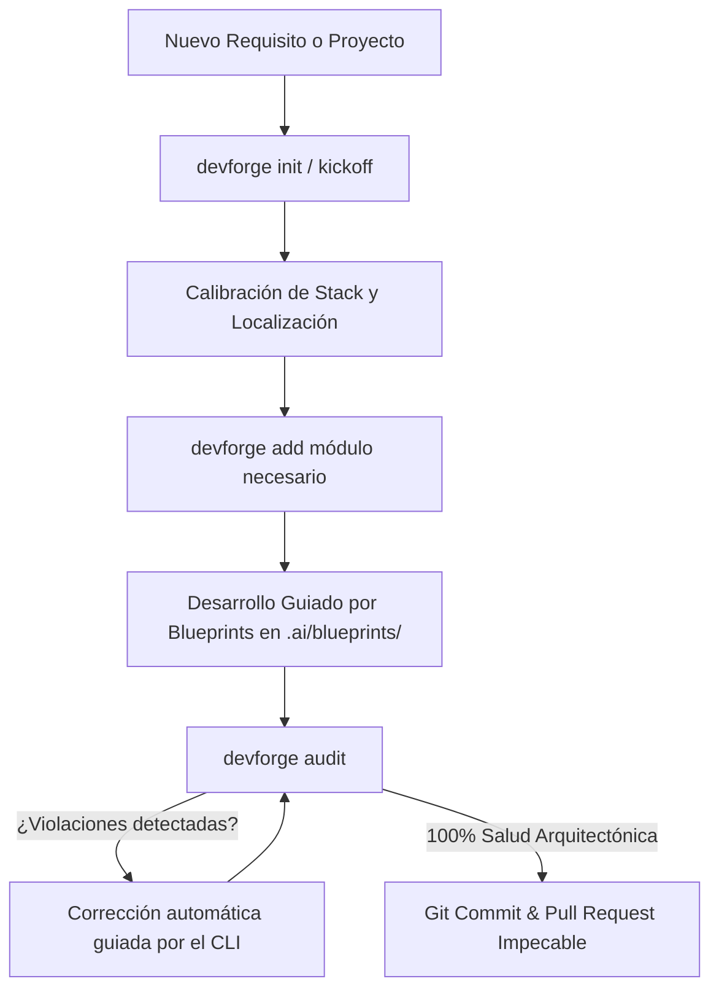

# ⚡ DEVFORGE

> **Protocolo Universal de Arquitectura y Capa de Contexto de IA para Proyectos Empresariales**  
> Compatible con **Google Antigravity**, **Claude Code**, **Cursor**, **OpenAI Codex**, **GitHub Copilot** y cualquier asistente de codificación con IA. Diseñado para aplicaciones de alto rendimiento en **Vue 3**, **React** y ecosistemas fullstack con **TypeScript**.

[](LICENSE)
[](https://nodejs.org/)
[](https://www.typescriptlang.org/)
[](#-filosofía-de-diseño-anti-ai)

---

## 🎯 ¿Qué es DEVFORGE?

**DEVFORGE** es un toolkit integral y una capa de gobernanza de contexto de Inteligencia Artificial que transforma la manera en que los desarrolladores y los agentes de IA colaboran en una base de código.

Los modelos de IA generativa suelen ser inconsistentes: inventan estructuras de carpetas, incrustan listas de datos falsos (*mock data*) directamente en los componentes, usan colores neón poco profesionales, mezclan inglés y español en la interfaz (*Spanglish*) y realizan consultas a bases de datos sin paginación.

**DEVFORGE resuelve esto de raíz proporcionando:**
1. **Un CLI determinista**: Comandos instantáneos para inicializar proyectos (`devforge init`), inyectar módulos de arquitectura (`devforge add <modulo>`) y auditar el código fuente en 1 segundo (`devforge audit`).
2. **Capa Multi-Agente Universal**: Archivos de contexto y configuración nativos para Antigravity (`AGENTS.md`, `.agents/skills/`), Claude Code (`CLAUDE.md`, `.claude/commands/`), Cursor (`.cursorrules`) y Copilot (`.github/copilot-instructions.md`).
3. **7 Blueprints de Producción**: Recetas de arquitectura probadas en batalla (OpenAPI SDK, Formularios Zod, Tablas sincronizadas con URL, RBAC CASL, In-App DevTools, Auth Silent Refresh y GraphQL Pagination).
4. **Estándares de Diseño y Gobernanza**: Reglas estrictas de UI/UX Pro Max, paletas neutrales Zinc, tipografía moderna, formateo localizado de datos y cero Spanglish.

---

## 🚨 Los 6 Mandamientos DEVFORGE (Pre-Flight Checklist)

Cada agente de IA que opere en un repositorio configurado con DEVFORGE tiene la obligación contractual de verificar estos 6 puntos antes de generar o editar cualquier archivo:

| # | Mandamiento | Regla Estricta | Alternativa Requerida |
| :-: | :--- | :--- | :--- |
| **1** | **Cero Datos Hardcodeados** | Prohibido declarar `const items = [ ... ]` o arreglos estáticos en componentes (`.vue`, `.tsx`). | Todo dato proviene de `props` tipados, servicios de dominio (`services/`) o composables/hooks asíncronos (`useQuery`). |
| **2** | **Paginación Obligatoria** | Prohibido consultar listas completas sin parámetros de página (`SELECT *` o `GET /items`). | Paginación obligatoria por cursor o desplazamiento (`page`, `pageSize`, `first`, `after`). Cero sobreconsulta. |
| **3** | **Formateo Localizado** | Prohibido imprimir números brutos como moneda (`"$ " + valor`) o fechas ISO (`2026-10-05T15:50:00Z`). | Usar formateadores oficiales: `formatCurrency()`, `formatDate()`, `formatPhoneNumber()`. Nulos se renderizan con em-dash `—`. |
| **4** | **Cero Spanglish (100% Español)** | Si la interfaz está en español, prohibida cualquier palabra en inglés en UI, botones o estados. | `Cerrar`, `Guardar`, `Estado`, `Monto`, `Acciones`, `Observado`, `Completado`, `Pendiente`. |
| **5** | **Cero Cyberpunk / Paleta Anti-AI** | Prohibidos los colores cian/teal fluorescentes (`cyan-*`, `#00ff9d`), degradados morados o badges radioactivos. | Paleta neutral pura (`zinc-950`, `zinc-900`, `border-zinc-800`) con badges translúcidos al 10% (`bg-emerald-500/10 text-emerald-400`). |
| **6** | **Seguridad Lógica y Tipado** | Prohibido el uso de `any` y mutaciones directas de `props`. | Encadenamiento opcional `record?.cliente?.nombre`, emisión de eventos (`emit`), tipos estrictos y esquemas Zod. |

---

## 📦 Estructura que DEVFORGE Despliega en tu Repositorio

Al ejecutar `devforge init`, se inyecta la siguiente infraestructura organizada y estandarizada:

```text
tu-proyecto/
├── .ai/                                  # 🧠 Cerebro y Gobernanza de IA
│   ├── AGENTS.md                         # Contexto para Antigravity, Gemini y Codex
│   ├── CLAUDE.md                         # Contexto para Claude Code
│   ├── .cursorrules                      # Reglas de contexto para Cursor IDE
│   ├── copilot-instructions.md           # Instrucciones para GitHub Copilot
│   ├── blueprints/                       # 📐 7 Blueprints de Arquitectura Empresarial
│   │   ├── 01-openapi-sdk.md             # SDK y hooks tipados desde Swagger/OpenAPI
│   │   ├── 02-schema-forms.md            # Formularios dinámicos con validación Zod
│   │   ├── 03-datagrid-url-sync.md       # Tablas sincronizadas con query params de URL
│   │   ├── 04-rbac-matrix.md             # Matriz de permisos RBAC/ABAC estilo CASL
│   │   ├── 05-in-app-devtools.md         # Cockpit flotante de depuración y simulación
│   │   ├── 06-auth-session.md            # Cola de refresco silencioso de tokens JWT
│   │   └── 07-graphql-pagination.md      # Paginación estricta y colocación de fragmentos
│   └── standards/                        # 📋 Estándares de Ingeniería y Diseño
│       ├── project-kickoff.md            # Protocolo de descubrimiento y calibración
│       ├── data-formatting.md            # Moneda, números, fechas, teléfonos y manejo de nulos
│       ├── theming.md                    # Tema claro + oscuro obligatorio con tokens semánticos
│       ├── module-api.md                 # API exacta de cada módulo (evita que la IA invente funciones)
│       ├── ui-ux-principles.md           # Diseño Anti-AI, regla 60-30-10 y espaciado
│       ├── project-structure.md          # Estructura de carpetas guiada por dominio
│       ├── architecture-standards.md     # Capas de servicio, desacoplamiento y paginación
│       └── typescript-rules.md           # Tipos discriminados, inmutabilidad y Zod
├── .claude/commands/                     # ⚡ Slash Commands para Claude Code
│   ├── kickoff.md                        # Comando /kickoff para calibrar el proyecto
│   └── devforge.md                       # Comando /devforge para consultar blueprints
├── .agents/skills/devforge/              # ⚡ Skill Nativo para Google Antigravity
│   └── SKILL.md                          # Protocolo de activación autónoma
├── .github/
│   └── copilot-instructions.md           # Reglas activas para GitHub Copilot
├── AGENTS.md                             # Protocolo raíz para agentes
├── CLAUDE.md                             # Protocolo raíz para Claude
└── .cursorrules                          # Reglas raíz para Cursor
```

---

## 🚀 Instalación y Configuración Inicial

### 1. Clonar y Vincular el CLI Globalmente (Solo una vez en tu máquina)

Para que el comando `devforge` esté disponible en cualquier terminal y en cualquier carpeta de tu equipo:

```bash
# 1. Clona el repositorio si aún no lo tienes
git clone https://github.com/LuisMTaveras/devforge.git
cd devforge/devforge

# 2. Instala dependencias
npm install

# 3. Enlaza el comando globalmente en tu sistema
npm link
```

> **Verificación**: Abre una nueva terminal y ejecuta:
> ```bash
> devforge --help
> ```
> Deberás ver el banner oficial de DEVFORGE con la lista de comandos disponibles.

---

## 🛠️ Cómo Implementar DEVFORGE en CADA Repositorio

### Escenario A: Implementación en un Proyecto Nuevo (Desde Cero / Greenfield)

Cuando vayas a crear una nueva aplicación web o backend:

```bash
# 1. Crea la carpeta de tu nuevo proyecto y navega a ella
mkdir mi-nuevo-proyecto
cd mi-nuevo-proyecto

# 2. Inicializa DEVFORGE en el repositorio
devforge init
```

Una vez ejecutado `devforge init`, la capa de IA ya está activa. Ahora abre tu editor y tu asistente preferido:

1. **En Claude Code o Antigravity**:
   - Ejecuta `/kickoff` (o dile al asistente *"Inicia el kickoff del proyecto con DEVFORGE"*).
2. **¿Qué hará la IA durante el Kickoff?**
   - **Calibración del Desarrollador**: Preguntará tu nivel de experiencia (Junior / Semi-Senior / Senior) para adaptar explicaciones y complejidad técnica.
   - **Asesoramiento de Stack**: Recomendará la mejor combinación tecnológica (Vue 3 + Vite + Tailwind + Pinia o React + Next.js + Zustand + TanStack Query) dándote siempre la decisión final.
   - **Configuración de Localización**: Definirá país, moneda (`DOP`, `USD`, `COP`, `EUR`), separadores de miles y decimales (`1,234.56` vs `1.234,56`), máscara de teléfono (`(809) 578-1234`), formato de fecha y huso horario.
   - **Temas Claro y Oscuro**: Todo proyecto se construye con ambos temas (Claro / Oscuro / Sistema). Solo se elige cuál es el predeterminado.
   - **Delimitación del MVP**: Definirá el alcance funcional mínimo antes de escribir una sola línea de código.
3. **Inyecta los módulos iniciales requeridos**:
   ```bash
   devforge add formatters   # Moneda, números, porcentajes, fechas y teléfonos por país
   devforge add theme        # Tema claro + oscuro (tokens, initTheme, useTheme)
   devforge add auth         # Autenticación segura con cola de refresco
   devforge add rbac         # Permisos por rol y directivas UI
   devforge add dates --vue       # Selector de fecha/rango y filtro de período (instala select)
   devforge add pagination --vue  # Pie de paginación estándar (instala flickerless)
   ```
4. **Comienza a codificar asistido por los blueprints** en `.ai/blueprints/`.
5. **Antes de subir tus cambios a Git, audita tu código**:
   ```bash
   devforge audit
   ```

---

### Escenario B: Implementación en un Proyecto Existente (Brownfield)

Si ya tienes un proyecto en producción o en desarrollo (Vue, React, Next.js, Nuxt, Node.js, etc.):

```bash
# 1. Navega a la raíz de tu proyecto existente
cd d:/Develop/mi-proyecto-existente

# 2. Inyecta DEVFORGE
devforge init
```

**¿Qué ocurre al ejecutar esto?**
- `devforge init` **no sobrescribe** tu código de negocio ni borra tus archivos existentes.
- Inyecta de forma segura los directorios `.ai/`, `.claude/`, `.agents/`, `.github/` y los archivos de contexto raíz (`AGENTS.md`, `CLAUDE.md`, `.cursorrules`).
- Tus asistentes de IA (Antigravity, Cursor, Claude, Copilot) entenderán de inmediato las reglas de calidad del proyecto.

**Siguientes pasos recomendados en proyectos existentes:**
1. **Audita el repositorio para identificar deuda técnica**:
   ```bash
   devforge audit
   ```
   El CLI escaneará tus archivos `.vue`, `.tsx`, `.jsx` y `.ts`, mostrando si tienes datos ficticios quemados en plantillas, palabras en inglés no traducidas o colores neón.
2. **Inyecta utilidades estándar para reemplazar código repetitivo**:
   ```bash
   # Si tu API maneja errores de forma desordenada:
   devforge add errors

   # Si necesitas exportar reportes a Excel/CSV sin problemas de caracteres:
   devforge add export

   # Si necesitas sincronizar tablas con los filtros de la URL:
   devforge add url-sync
   ```

---

## 💻 Referencia Completa de Comandos CLI

El ejecutable `devforge` proporciona los siguientes comandos:

```bash
devforge <comando> [opciones]
```

### 1. `devforge init`
Despliega la capa universal de IA en el repositorio actual:
- Copia las plantillas de agentes (`AGENTS.md`, `CLAUDE.md`, `.cursorrules`, `copilot-instructions.md`).
- Instala los 7 Blueprints en `.ai/blueprints/`.
- Instala las guías de ingeniería y diseño en `.ai/standards/`.
- Configura comandos slash en `.claude/commands/` y el skill en `.agents/skills/`.

### 2. `devforge audit`
Realiza un escaneo estático ultra rápido (en menos de un segundo) sobre todos los archivos del proyecto analizando el cumplimiento de los mandamientos DEVFORGE:
- **Zero Hardcoded Data**: Detecta `const lista = [{ ... }]` quemados dentro de componentes.
- **Anti-AI Cyberpunk Palette**: Detecta colores prohibidos como `cyan-*`, `teal-*`, `#00ff9d`.
- **Zero-Spanglish**: Detecta textos comunes en inglés en botones y estados (`Close`, `Save`, `Status`, `Amount`, `Pending`).
- **Unformatted Currency**: Detecta montos monetarios formateados a mano con `$` en lugar de usar `formatCurrency()`.
- **Puntuación de Salud Arquitectónica**: Calcula el porcentaje de cumplimiento de 0% a 100%.

### 3. `devforge list`
Muestra en consola el catálogo interactivo de todos los Blueprints, estándares y módulos de código disponibles para consultar o inyectar.

### 4. `devforge add <módulo>`
Inyecta módulos de código limpios, probados y con TypeScript estricto en la estructura de tu proyecto:

| Módulo | Comando | Archivos Generados en tu Proyecto | Propósito |
| :--- | :--- | :--- | :--- |
| **Autenticación** | `devforge add auth` | `src/core/auth/auth-token.ts`<br>`src/core/auth/silent-refresh-queue.ts`<br>`src/modules/auth/stores/auth.store.ts` | Gestión de tokens JWT, almacenamiento seguro y cola anti-colisión para refresco de sesión en peticiones paralelas. |
| **Errores de API** | `devforge add errors` | `src/core/errors/api-error.ts` | Normalizador universal de errores HTTP compatible con Laravel, Express, NestJS, FastAPI y Spring. |
| **Exportación** | `devforge add export` | `src/core/export/export-engine.ts` | Exportación de datos a CSV y Excel con cabecera UTF-8 BOM para soporte total de tildes y caracteres especiales. |
| **Formateadores** | `devforge add formatters` | `src/core/formatters/formatters.ts` | Motores de formato localizado por país (República Dominicana por defecto; `setFormatCountry('CO')` para cambiarlo): moneda (`RD$1,500.00`), números con comas y puntos (`1,234,567.89`), porcentajes, fechas relativas, teléfonos (`(809) 578-1234`) y reemplazo de nulos por `—`. |
| **Tema Claro / Oscuro** | `devforge add theme` | `src/core/theme/theme.ts`<br>`src/shared/styles/tokens.css`<br>`src/shared/composables/useTheme.ts` (Vue)<br>`src/shared/hooks/useTheme.ts` (React) | Motor de temas Claro / Oscuro / Sistema con persistencia, tokens semánticos para Tailwind v4 y script anti-parpadeo. |
| **Permisos RBAC** | `devforge add rbac` | `src/core/permissions/ability.ts`<br>`src/shared/components/Can.tsx` (React)<br>`src/shared/directives/v-can.ts` (Vue) | Motor de permisos declarativo basado en habilidades (estilo CASL), directiva `v-can` para Vue 3 y componente `<Can />` para React. |
| **Sincronización URL** | `devforge add url-sync` | `src/core/url-sync/url-state.ts` | Sincronización bidireccional entre estados de filtros/paginación y los `URLSearchParams` del navegador. |
| **Flickerless** | `devforge add flickerless` | `src/shared/flickerless/core/*`<br>`src/shared/flickerless/vue/*`<br>`src/shared/flickerless/react/*`<br>`src/shared/flickerless/flickerless.css` | Reemplazo del skeleton ([github.com/LuisMTaveras/flickerless](https://github.com/LuisMTaveras/flickerless)): lo que estaba se queda atenuado con una barra de 2 px, lo que no se sabe es «—», y la carga en frío pinta la tabla real. |
| **Combo** | `devforge add select` | `src/shared/components/SelectField.vue` | Desplegable estándar que reemplaza al `<select>` nativo: menú teleportado (no se recorta en modales), tema claro/oscuro, grupos, opciones deshabilitadas y teclado. |
| **Fechas** | `devforge add dates` | `src/core/dates/date-range.ts`<br>`src/shared/components/DatePicker.vue`<br>`src/shared/components/DateRangeFilter.vue` | Selector de fecha o rango (dos meses lado a lado, `dd/mm/aaaa`) y filtro de período con atajos (Hoy, Ayer, Este mes…), flechas de día y rango personalizado. «Hoy» se calcula en la zona de RD. |
| **Paginación** | `devforge add pagination` | `src/core/pagination/pagination.ts`<br>`src/shared/components/ListPager.vue` | Pie de listado estándar: «Mostrando 11–20 de 57 facturas» y ‹ 2 / 6 ›, con «—» hasta la primera respuesta. |

---

## 📐 Los 7 Blueprints de Arquitectura Empresarial

Ubicados en `.ai/blueprints/`, estos documentos son recetas canónicas que instruyen a tu IA exactamente sobre cómo estructurar patrones complejos:

1. **`01-openapi-sdk.md` (OpenAPI/Swagger a SDK Tipado)**:
   - Elimina la escritura manual de interfaces TypeScript y llamadas `fetch`/`axios` sueltas.
   - Genera clientes de API 100% tipados y hooks/composables de TanStack Query o Vue automáticamente desde el JSON del Swagger.

2. **`02-schema-forms.md` (Formularios Dinámicos con Esquemas Zod)**:
   - Elimina el código repetitivo en formularios. Define un único esquema de **Zod** y renderiza dinámicamente campos accesibles, selects, switches, validaciones reactivas y mensajes de error.

3. **`03-datagrid-url-sync.md` (Tablas de Datos + Sincronización con URL)**:
   - Conecta tablas (TanStack Table o componentes de datos) con la barra de direcciones (`?page=2&search=acme&sort=-fecha&estado=activo`). Permite compartir URLs con filtros exactos y soporta el historial del navegador (*atrás/adelante*).

4. **`04-rbac-matrix.md` (Control de Acceso Declarativo RBAC / ABAC)**:
   - Elimina condicionales caóticos como `if (user.role === 'admin' || user.permisos.includes('editar'))`. Implementa verificación declarativa:
     - En React: `<Can I="update" an="Invoice">...</Can>`
     - En Vue: `<button v-can="['update', 'Invoice']">Guardar</button>`

5. **`05-in-app-devtools.md` (Cockpit Flotante de Depuración)**:
   - Barra de herramientas flotante exclusiva de entorno de desarrollo (`NODE_ENV === 'development'`) que permite al equipo cambiar de rol en un clic, simular latencia de red 3G/4G e inyectar errores 401 o 500 para probar la resiliencia de la app.

6. **`06-auth-session.md` (Sesión Empresarial y Cola de Refresco Silencioso)**:
   - Soluciona el problema de condición de carrera (*race condition*) cuando expira el token de acceso y 5 peticiones paralelas reciben un `401 Unauthorized`. Las encola detrás de una sola solicitud de refresco sin cerrar la sesión del usuario.

7. **`07-graphql-pagination.md` (Paginación Estricta y Optimización GraphQL)**:
   - Asegura paginación obligatoria basada en cursores o desplazamiento, colocación de fragmentos por componente y cero sobreconsulta de campos a la base de datos.

---

## 🎨 Filosofía de Diseño Anti-AI (UI/UX Pro Max)

DEVFORGE destierra la estética predecible y sobrecargada que suelen generar los modelos de IA, aplicando principios visuales de nivel enterprise (inspirados en Linear, Stripe y Vercel):

### 1. Regla de Color 60-30-10
- **60% Superficie Neutra**: Fondos profundos y sobrios con escala Zinc (`bg-zinc-950`, `bg-zinc-900`, `border-zinc-800`).
- **30% Jerarquía Tipográfica**: Textos contrastados y legibles (`text-zinc-100`, `text-zinc-400`, `text-zinc-500`).
- **10% Acento Funcional**: Color de acción enfocado exclusivamente en llamadas a la acción primarias (CTA) e indicadores de estado.

### 2. Badges Suaves (Soft-Tint Badges)
- **Prohibido**: Píldoras con colores fluorescentes y fondos opacos agresivos.
- **Obligatorio**: Fondos translúcidos con opacidad reducida y bordes sutiles:
  ```html
  <!-- Ejemplo: Estado exitoso/completado -->
  <span class="bg-emerald-500/10 text-emerald-400 border border-emerald-500/20 px-2.5 py-0.5 rounded-full text-xs font-medium">
    Completado
  </span>
  ```

### 3. Cero Spanglish en la Interfaz
Toda aplicación en español debe mantener consistencia lingüística absoluta:
- `Close` ➔ **Cerrar**
- `Save` ➔ **Guardar**
- `Status` ➔ **Estado**
- `Amount` ➔ **Monto**
- `Actions` ➔ **Acciones**
- `Pending` ➔ **Pendiente**
- `Settled` ➔ **Completado**
- `Flagged` ➔ **Observado**
- `Reversed` ➔ **Revertido**

---

## 🤖 Compatibilidad Multi-Asistente de IA

DEVFORGE funciona de forma nativa e integrada con los principales entornos y asistentes de IA del mercado:

| Asistente de IA | Archivo de Contexto Utilizado | Características Nativas |
| :--- | :--- | :--- |
| **Google Antigravity** | `AGENTS.md` y `.agents/skills/devforge/` | Activación automática de la skill `devforge`, verificación del pre-flight checklist y ejecución de blueprints. |
| **Claude Code** | `CLAUDE.md` y `.claude/commands/` | Slash commands nativos en terminal: `/kickoff` (descubrimiento inicial) y `/devforge` (asistente de blueprints). |
| **Cursor IDE** | `.cursorrules` y `.ai/` | Carga contextual permanente de reglas de arquitectura en chats y autocompletado en el editor. |
| **GitHub Copilot** | `.github/copilot-instructions.md` | Instrucciones de repositorio compartidas para agentes de Copilot y pull requests. |
| **OpenAI Codex / ChatGPT** | `AGENTS.md` | Protocolo universal de instrucciones de sistema y restricciones de diseño. |

---

## 🛡️ Cómo Evita DEVFORGE que la IA Alucine

Las instrucciones (`CLAUDE.md`, `AGENTS.md`, `.cursorrules`, Copilot) incluyen el punto **ZERO HALLUCINATION** y un **orden de verdad** para cuando las fuentes no coinciden:

1. Lo que el usuario pide explícitamente en la conversación.
2. El código instalado en el proyecto (`src/`, `package.json`).
3. `.ai/standards/module-api.md`: la lista **exacta** de funciones de cada módulo. Si algo no está ahí, no existe.
4. Los estándares de `.ai/standards/`.
5. Los blueprints de `.ai/blueprints/`, que son patrones de referencia que se adaptan, no se copian a ciegas.

Además, la IA tiene prohibido inventar paquetes, endpoints, campos de GraphQL o variables de entorno. Antes debe leer `package.json`, `v1.d.ts` y `.env.example`, y si algo no está, preguntar.

> ⚠️ Usa siempre el comando `devforge` enlazado con `npm link`. **No uses `npx devforge`**: en npm existe otro paquete con ese nombre que no tiene relación con este proyecto.

---

## 🏗️ Estructura de Código Recomendada para tus Proyectos

Cuando desarrolles una aplicación con DEVFORGE, la estructura de carpetas en `src/` seguirá el estándar de Arquitectura Orientada a Dominios:

```text
src/
├── app/                        # Configuración global, router, proveedores y layout raíz
├── core/                       # Utilidades agnósticas, formatters, clientes HTTP y motores
│   ├── auth/                   # Cola de refresco silencioso y tokens
│   ├── errors/                 # Normalizador de errores de API
│   ├── export/                 # Motores de exportación a CSV/Excel
│   ├── formatters/             # Formato localizado de moneda, números, fechas y teléfonos
│   ├── permissions/            # Motor de habilidades RBAC (Ability)
│   ├── theme/                  # Motor de tema claro / oscuro
│   └── url-sync/               # Sincronizador de parámetros de URL
├── modules/                    # Dominios de negocio independientes (Modular)
│   └── [modulo]/               # Ej: clientes, facturas, productos
│       ├── components/         # Componentes específicos del dominio
│       ├── composables/        # Hooks (React) o Composables (Vue)
│       ├── services/           # Capa de consumo de API (sin llamadas directas en componentes)
│       ├── types/              # Contratos TypeScript y esquemas Zod
│       └── index.ts            # Punto de exportación pública del módulo
└── shared/                     # Primitivas reutilizables de UI (Botones, Modales, Tablas)
```

---

## 🔄 Flujo de Trabajo Recomendado en el Día a Día



1. **Paso 1**: Inicializa el repo con `devforge init`.
2. **Paso 2**: Calibra el proyecto con tu IA usando `/kickoff`.
3. **Paso 3**: Inyecta las piezas base con `devforge add <modulo>`.
4. **Paso 4**: Construye interfaces y servicios con asistencia de la IA siguiendo los Blueprints.
5. **Paso 5**: Ejecuta `devforge audit` antes de realizar cada commit para garantizar que no existan datos quemados, Spanglish ni colores neón.

---

## 📄 Licencia

Este proyecto está distribuido bajo la licencia **MIT**. Consulta el archivo `LICENSE` para más detalles.

---

<div align="center">
  <sub>Construido con precisión artesanal por el equipo de <b>DEVFORGE</b>. Diseñado para elevar la ingeniería de software asistida por IA.</sub>
</div>
